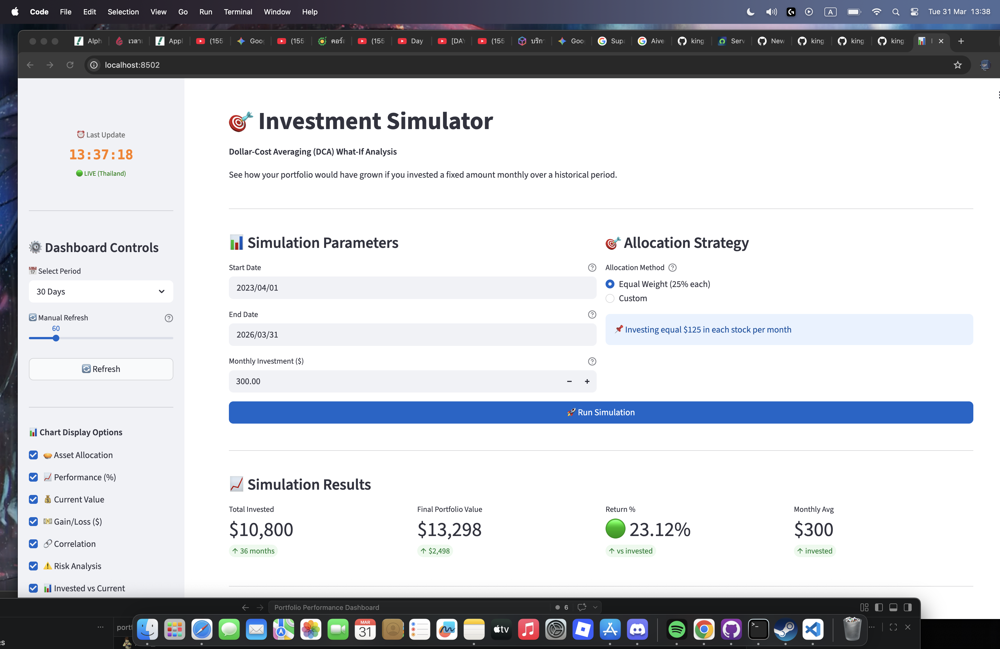
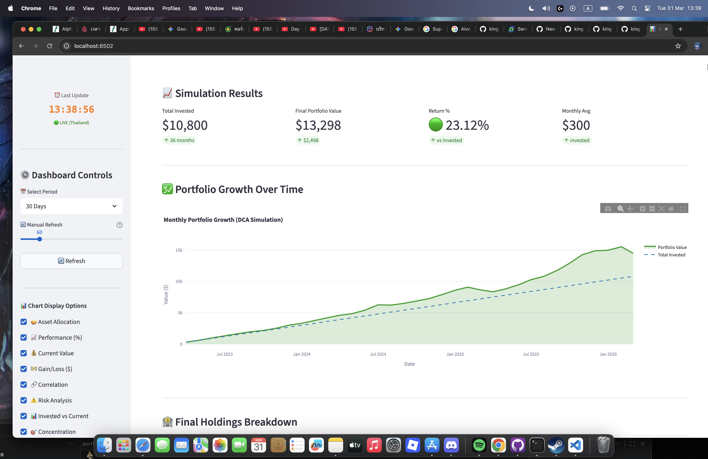
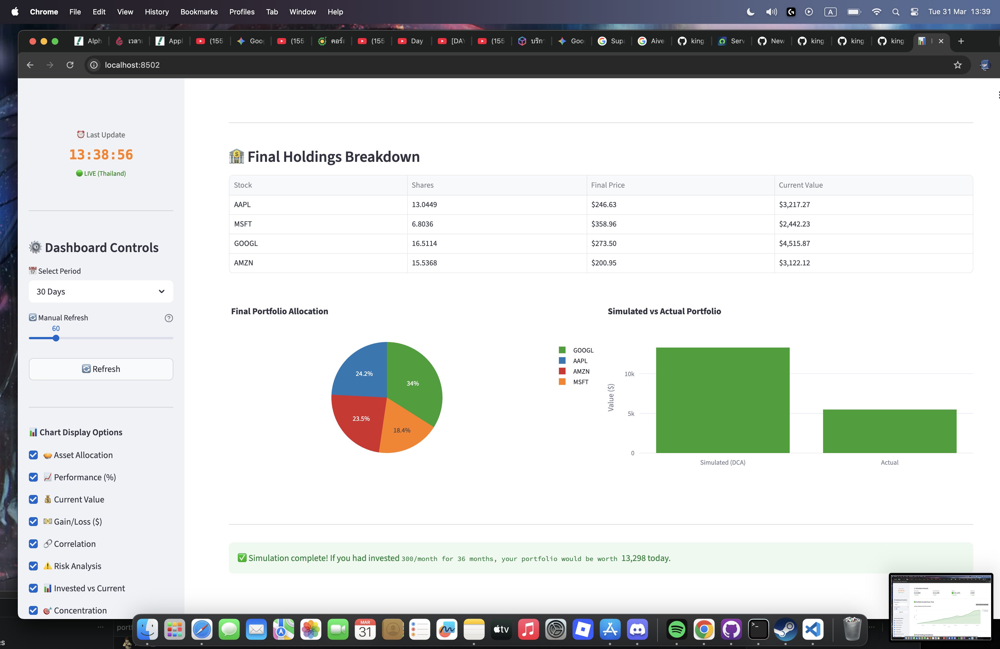
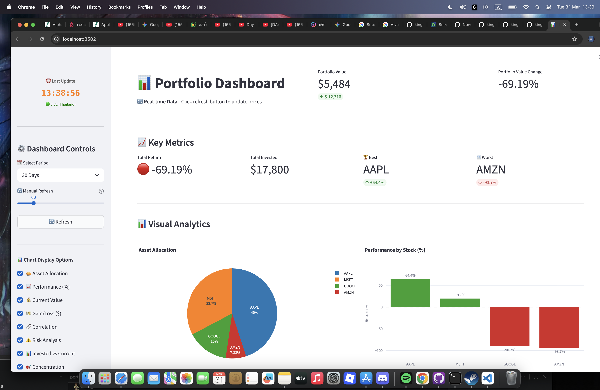
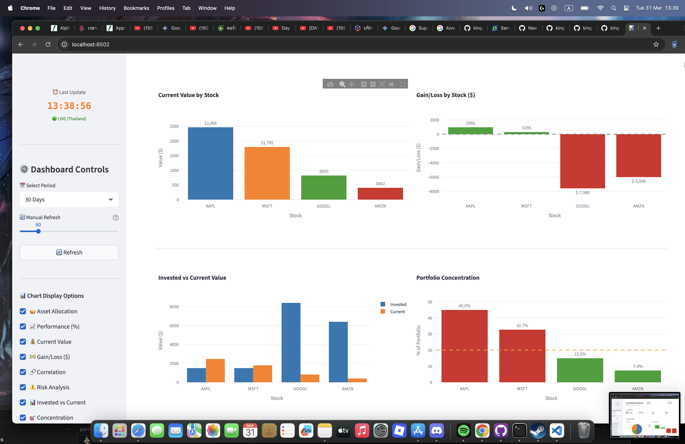
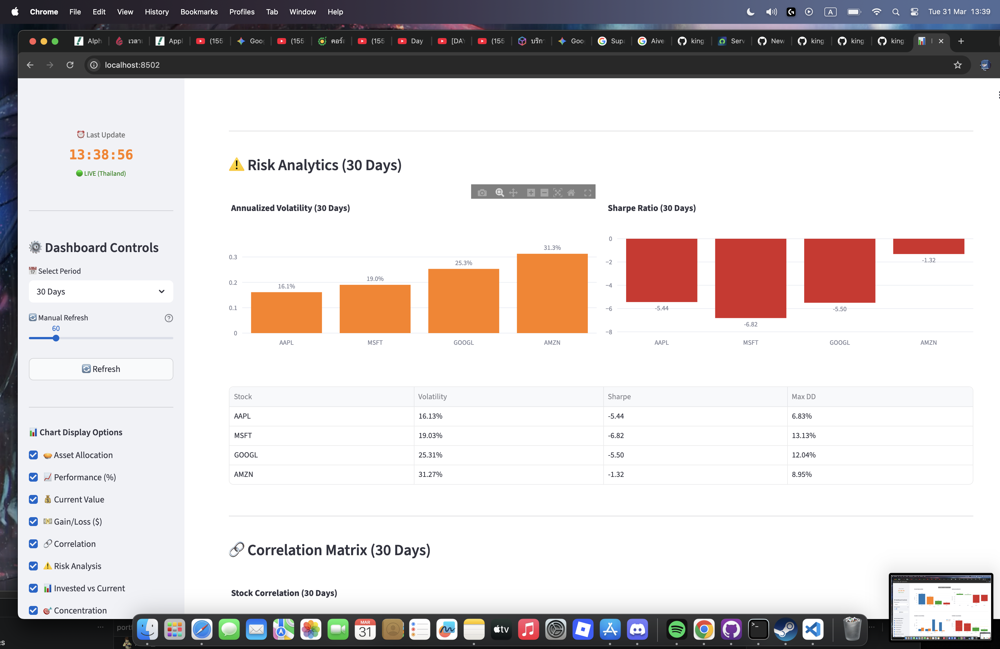
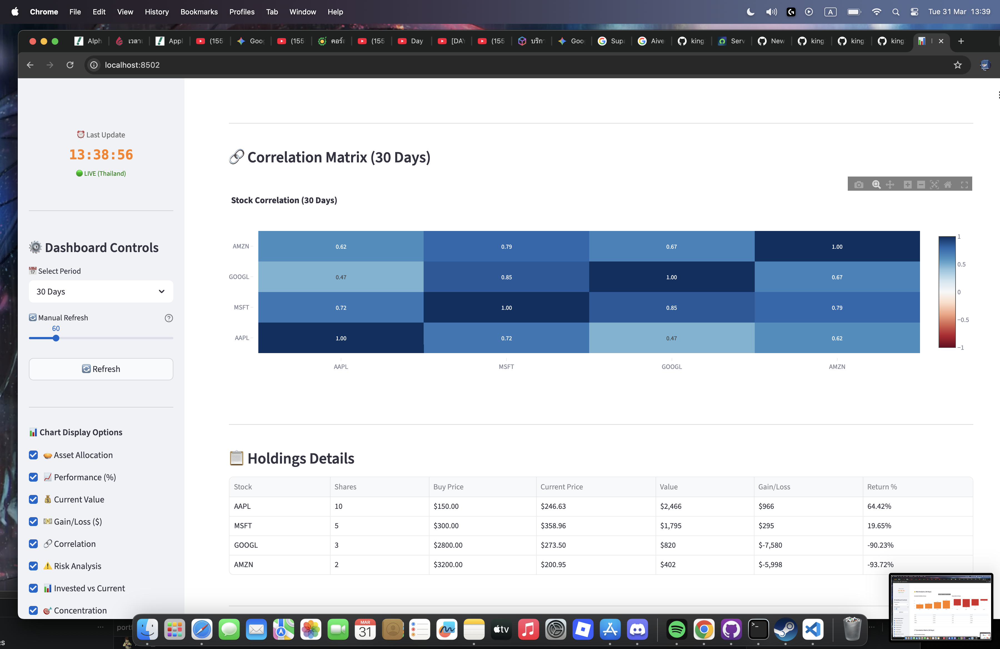
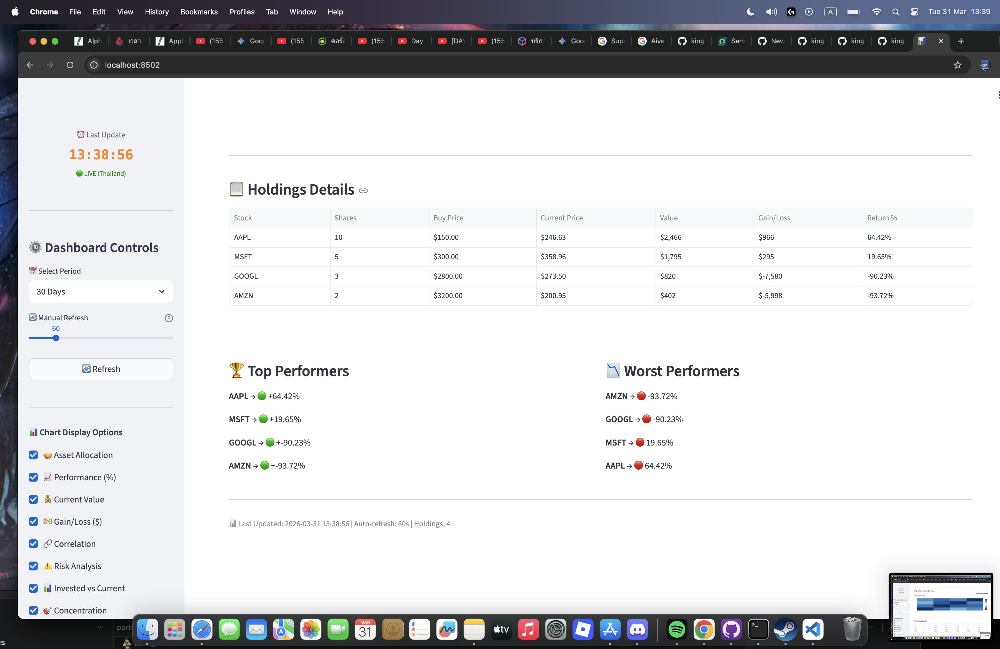

# 📊 Portfolio Performance Dashboard

A **production-ready, real-time** stock portfolio analytics dashboard built with Streamlit and Yahoo Finance. Features real-time data visualization, risk analytics, and an advanced **DCA (Dollar-Cost Averaging) simulator** for data-driven investment decisions.

*Perfect for practicing **Data Analytics**, **Business Intelligence**, and **Decision Support Systems** skills.*

[](https://www.python.org/downloads/)
[](https://github.com/streamlit/streamlit)
[](LICENSE)

**🚀 [Live Demo - Deploy to Streamlit Cloud](#deployment)** | **📖 [Full Documentation](ARCHITECTURE.md)**

---

## ✨ Key Features

### 📈 Real-Time Dashboard (Tab 1)
- **Live Stock Prices** from Yahoo Finance (auto-refresh 10-300 sec)
- **8 Interactive Charts** built with Plotly
- **Risk Analytics** - Volatility, Sharpe Ratio, Max Drawdown
- **Correlation Analysis** - Stock relationships heatmap
- **Period-Based Analysis** - 7/30/90 day analysis windows
- **Thailand Time Zone** with live update indicator

### 🎯 Investment Simulator (Tab 2) - *Unique Feature*
**What-If Analysis for Strategic Decisions**
- **Dollar-Cost Averaging (DCA)** backtester
- "If I had invested $X/month starting 3 years ago, where would I be today?"
- Compare simulated vs actual portfolio performance
- Visualize growth trajectory with confidence metrics
- Test different allocation strategies
- **Business Value**: Demonstrates understanding of investment strategy and data-driven decision making

### 📊 Visual Analytics Suite
| Chart | Purpose | Business Insight |
|-------|---------|------------------|
| 🥧 Asset Allocation | Portfolio composition | Risk concentration |
| 📈 Performance (%) | Return by stock | Top/bottom performers |
| 💰 Current Value | Nominal holdings | Absolute value at risk |
| 💵 Gain/Loss ($) | Dollar impact | Economic impact |
| 🔗 Correlation | Stock relationships | Diversification quality |
| ⚠️ Risk Metrics | Volatility & Sharpe | Risk-adjusted returns |
| 📊 Invested vs Current | Purchase vs market | Strategic allocation success |
| 🎯 Concentration | % per holding | Concentration risk (>30% flag) |

---

## 📸 Screenshots

### Dashboard Tab - Real-Time Analytics


### Portfolio Metrics & KPIs


### Interactive Charts - Performance


### Interactive Charts - Allocation


### Invested vs Current Value


### Risk Analysis (Volatility & Sharpe Ratio)


### Correlation Heatmap


### Investment Simulator (DCA Strategy)


---

## 🏗️ Architecture & Data Flow

```
┌─────────────────────────────────────────────────────────────────┐
│                     Streamlit Web App                           │
│  ┌──────────────────────────┬──────────────────────────────┐    │
│  │   Tab 1: Dashboard       │   Tab 2: Simulator           │    │
│  │  ✅ Real-time metrics    │  ✅ What-if analysis        │    │
│  │  ✅ 8 interactive charts │  ✅ DCA backtesting         │    │
│  │  ✅ Risk analytics       │  ✅ Allocation strategies   │    │
│  └──────────────────────────┴──────────────────────────────┘    │
│                          ▲                                       │
└──────────────────────────┼───────────────────────────────────────┘
                           │
                ┌──────────┴──────────┐
                │                     │
         ┌──────▼──────┐      ┌──────▼──────┐
         │ Analyzer    │      │  Simulator  │
         │ (analyzer.  │      │ (simulator. │
         │   py)       │      │   py)       │
         └──────┬──────┘      └──────┬──────┘
                │                    │
         ┌──────▼────────────────────▼──────┐
         │   StockDataFetcher               │
         │   (data_fetcher.py)              │
         │ • get_current_prices()           │
         │ • get_price_history()            │
         └──────┬─────────────────────────┬─┘
                │                         │
        ┌───────▼─────────┐       ┌───────▼──────────┐
        │ Yahoo Finance   │       │ Historical Data  │
        │ (yfinance API)  │       │ (3+ years)       │
        └─────────────────┘       └──────────────────┘
```

### Module Design

| Module | Responsibility | Key Functions |
|--------|-----------------|---|
| **portfolio.py** | Data model for holdings | `.add_holding()`, `.get_symbols()` |
| **data_fetcher.py** | Yahoo Finance integration | `.get_multiple_prices()`, `.get_price_history()` |
| **analyzer.py** | Core analytics engine | `.calculate_risk_metrics()`, `.calculate_correlation_matrix()` |
| **simulator.py** *NEW* | DCA backtesting | `.simulate_dca()` with historical optimization |
| **streamlit_advanced.py** | UI orchestration | 2 tabs, real-time refresh, responsive controls |

---

## 📁 Project Structure

```
portfolio-performance-dashboard/
├── streamlit_advanced.py          # 🎯 Main app (2 tabs: Dashboard & Simulator)
├── src/
│   ├── __init__.py
│   ├── portfolio.py               # Portfolio data model
│   ├── analyzer.py                # Analytics engine
│   ├── data_fetcher.py            # Yahoo Finance integration
│   ├── simulator.py               # 🆕 DCA simulation
│   └── reporter.py                # Export utilities
├── tests/
│   ├── test_portfolio.py
│   ├── test_analyzer.py
│   └── test_simulator.py
├── .streamlit/
│   ├── config.toml                # Streamlit configuration
│   └── secrets.toml.example       # Template for secrets (not committed)
├── requirements_streamlit.txt     # Production deps
├── requirements-dev.txt           # Dev deps (pytest, black, etc.)
├── README.md                      # This file
├── ARCHITECTURE.md                # Technical deep-dive
├── DEPLOYMENT.md                  # Cloud deployment guide
├── DEVELOPMENT.md                 # Contributor guide
└── .gitignore                     # Git ignore rules
```

---

## 🚀 Quick Start

### Prerequisites
- Python 3.9+
- pip or conda

### Installation (5 minutes)

```bash
# 1. Clone repo
git clone https://github.com/yourusername/portfolio-performance-dashboard.git
cd portfolio-performance-dashboard

# 2. Create virtual environment
python -m venv .venv
source .venv/bin/activate  # Windows: .venv\Scripts\activate

# 3. Install dependencies
pip install -r requirements_streamlit.txt

# 4. Run the app
streamlit run streamlit_advanced.py --server.port 8502
```

Open browser to: **http://localhost:8502**

### First-Time Use

**Dashboard Tab (📊)**
1. See real-time portfolio metrics
2. Toggle charts on/off in sidebar
3. Select time period (7/30/90 days)
4. Watch auto-refresh (default 60 sec)

**Simulator Tab (🎯)**
1. Set start date (3 years ago by default)
2. Input monthly investment ($500 default)
3. Choose allocation (equal weight or custom)
4. Click "Run Simulation"
5. Compare simulated vs actual results

---

## 📊 Features Deep Dive

### Dashboard Analytics

**Real-Time Metrics**
```
Portfolio Value:  $5,741.20  (+$142.30)  ← Live update every 60s
Total Return:     +2.54%     ← Percent change from invested
Best Performer:   MSFT       +8.32%      ← Winner & loser
Worst Performer:  AMZN       -1.45%
Holdings:         4 stocks
```

**Time Period Selection**
- **7 Days**: Short-term trends, recent volatility
- **30 Days**: Standard monthly analysis (default)
- **90 Days**: Quarterly performance, seasonal patterns

**Risk Metrics Explained** (for business context)
- **Volatility** (📊): Standard deviation of returns. Higher = riskier stock.
- **Sharpe Ratio** (📈): Return per unit of risk. Higher = better risk-adjusted returns.
- **Max Drawdown** (📉): Worst peak-to-trough decline. Indicates downside risk.

### Investment Simulator

**How It Works**
1. Simulates monthly purchases at $X amount
2. Uses actual historical prices from start date to today
3. Respects actual trading days (weekends/holidays excluded)
4. Calculates final portfolio value using today's market prices
5. Compares gain/loss vs actual portfolio

**Example Scenario**
```
Input:
  - Start:    Jan 1, 2023 (3 years ago)
  - End:      Mar 29, 2026 (today)
  - Amount:   $500/month
  - Strategy: Equal weight (25% each stock)

Output:
  - Total Invested:     $18,000   ($500 × 36 months)
  - Portfolio Value:    $19,247
  - Gain/Loss:          +$1,247  (+6.9%)
  - Compare to Actual:  [comparison chart]
```

**Business Value**
- Test investment strategies without real money
- Make informed decisions on allocation
- Understand impact of entry timing
- Validate risk/reward assumptions

---

## 🔧 Configuration

### Modify Holdings

Edit `streamlit_advanced.py` lines 100-104:
```python
portfolio.add_holding("AAPL", 10, 150.00, "2023-01-15")  # shares, price, date
portfolio.add_holding("MSFT", 5, 300.00, "2023-03-20")
portfolio.add_holding("GOOGL", 3, 2800.00, "2023-06-10")
portfolio.add_holding("AMZN", 2, 3200.00, "2023-08-05")
```

### Streamlit Settings

Edit `.streamlit/config.toml`:
- Server port
- Theme colors
- Cache settings
- Logging level

### Time Zone

Edit `streamlit_advanced.py` line 25 for your timezone:
```python
bangkok_tz = timezone(timedelta(hours=7))  # UTC+7 (Bangkok)
# Change 7 to your timezone offset (e.g., -5 for EST)
```

---

## 📈 Data Source & Market Hours

**Provider**: Yahoo Finance
- **No API key required** - Uses public yfinance library
- **Real-time pricing** during market hours
- **Market Hours** (EDT): 9:30 AM - 4:00 PM, Mon-Fri
- **Thailand Time**: 10:30 PM - 5:00 AM+1 (overnight)
- **Update Frequency**: 10-300 seconds (configurable)
- **Data Freshness**: Always fresh (no caching, ttl=0)

---

## 🧪 Testing

### Run Tests
```bash
pip install -r requirements-dev.txt
pytest tests/ -v
```

### Test Coverage
```bash
pytest tests/ --cov=src --cov-report=html
open htmlcov/index.html
```

### What's Tested
- Portfolio data model operations
- Analytics calculations  (volatility, Sharpe, correlation)
- Simulator DCA algorithm
- Error handling & edge cases

---

## 🚀 Deployment

### Streamlit Community Cloud (Recommended - Free)

1. Push code to GitHub
2. Visit [share.streamlit.io](https://share.streamlit.io)
3. "Create app" → select repo, branch, main file
4. Deploy (takes 1-2 minutes)

**Automatic Redeploy**: Any push to main branch auto-redeploys

See [DEPLOYMENT.md](DEPLOYMENT.md) for full guide.

### Docker (Self-Hosted)

```bash
docker build -t portfolio-dashboard .
docker run -p 8501:8501 portfolio-dashboard
```

### AWS, Google Cloud, Azure

See [DEPLOYMENT.md](DEPLOYMENT.md) for step-by-step guides.

---

## 📚 Documentation

- **[ARCHITECTURE.md](ARCHITECTURE.md)** - Technical design, module details, data flow
- **[DEPLOYMENT.md](DEPLOYMENT.md)** - Cloud deployment, Docker, monitoring
- **[DEVELOPMENT.md](DEVELOPMENT.md)** - Contributing, code style, adding features

---

## ⚙️ Technology Stack

| Component | Technology | Purpose |
|-----------|-----------|---------|
| Frontend | Streamlit 1.28+ | Interactive web UI |
| Data Processing | Pandas, NumPy | Manipulation & calculations |
| Visualization | Plotly | Interactive charts |
| Data Source | yfinance | Yahoo Finance API |
| Scientific | SciPy | Statistical calculations |
| Testing | pytest | Unit testing |
| Code Quality | Black, Flake8, mypy | Linting & formatting |

---

## ❓ FAQ

**Q: How do I update the stocks in my portfolio?**
A: Edit `streamlit_advanced.py` line 100-104 with your symbols and purchase details.

**Q: Why no real-time update outside market hours?**
A: Yahoo Finance only provides prices during US market hours (9:30 AM - 4:00 PM EDT). Prices freeze after market close.

**Q: Can I export data?**
A: Yes! Use the Holdings table export feature or check `reporter.py` for more export options.

**Q: How do I handle dividends?**
A: Currently not included in simulator. See `DEVELOPMENT.md` for adding dividend support.

**Q: Is my data secure?**
A: All data is public stock data from Yahoo Finance. No personal/sensitive data stored.

**Q: Can I run this on my own server?**
A: Yes! Docker or any Python-capable server. See [DEPLOYMENT.md](DEPLOYMENT.md).

---

## 🤝 Contributing

Contributions welcome! See [DEVELOPMENT.md](DEVELOPMENT.md) for:
- Code style guidelines
- How to add new metrics/charts
- Testing requirements
- Pull request process

```bash
# Example: Add a new feature
git checkout -b feature/my-feature
# ... make changes ...
pytest tests/  # Run tests
git push origin feature/my-feature
# Open PR
```

---

## 📝 License

MIT License - See [LICENSE](LICENSE) for full text.

Free for personal, educational, and commercial use with attribution.

---

## 🙏 Acknowledgments

- **Yahoo Finance** - Free stock data via yfinance
- **Streamlit** - Elegant web framework
- **Plotly** - Beautiful interactive visualizations
- **SciPy/NumPy/Pandas** - Data science foundations

---

## 📧 Contact

- **GitHub**: [yourusername/portfolio-performance-dashboard](https://github.com/yourusername/portfolio-performance-dashboard)
- **Issues**: [GitHub Issues](https://github.com/yourusername/portfolio-performance-dashboard/issues)
- **Email**: [your.email@example.com]

---

**For Interviews & Hiring Teams:**

This project demonstrates:
✅ **Data Engineering** - ETL pipeline, data fetching, transformation
✅ **Data Analytics** - Multi-dimensional analysis, time-series processing
✅ **Business Intelligence** - Dashboarding, decision support
✅ **Software Engineering** - Modular architecture, testing, deployment
✅ **Full-Stack** - Backend logic + interactive frontend
✅ **Cloud Deployment** - Production-ready, scalable

**Key Highlights for DA Role**:
- Real-time data processing with Streamlit
- Risk analytics & portfolio optimization concepts
- What-if analysis & scenario modeling (DCA simulator)
- Clean, maintainable Python code
- Comprehensive documentation
- Deployed to production (Streamlit Cloud)

---

**Happy investing & coding! 📈💻**

*Disclaimer: For educational purposes. Always consult a financial advisor before investing.*
