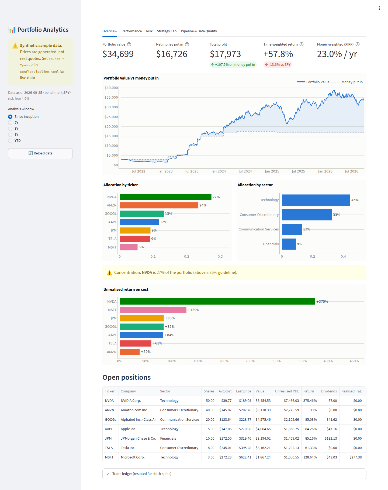
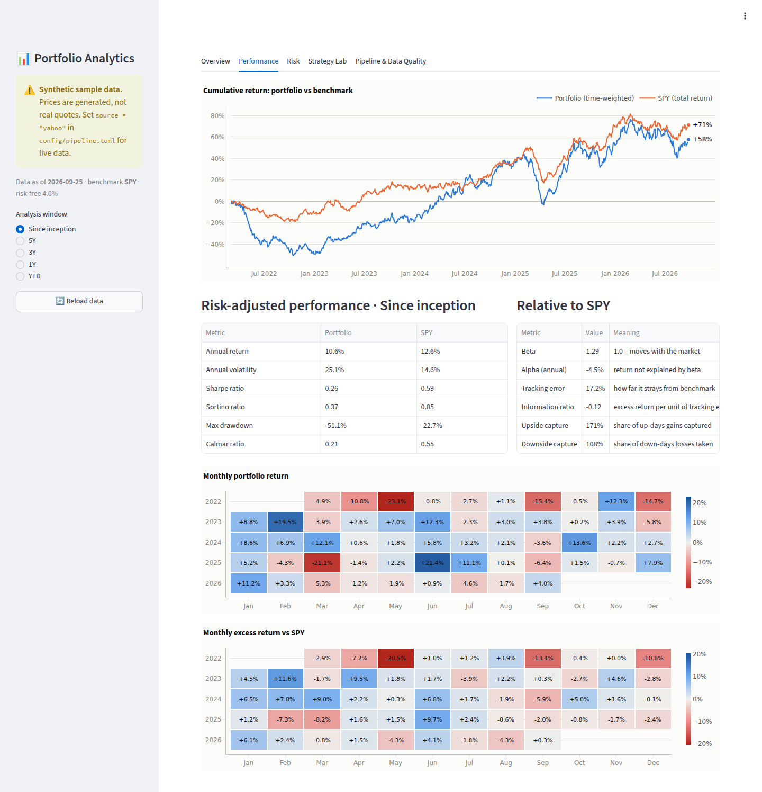
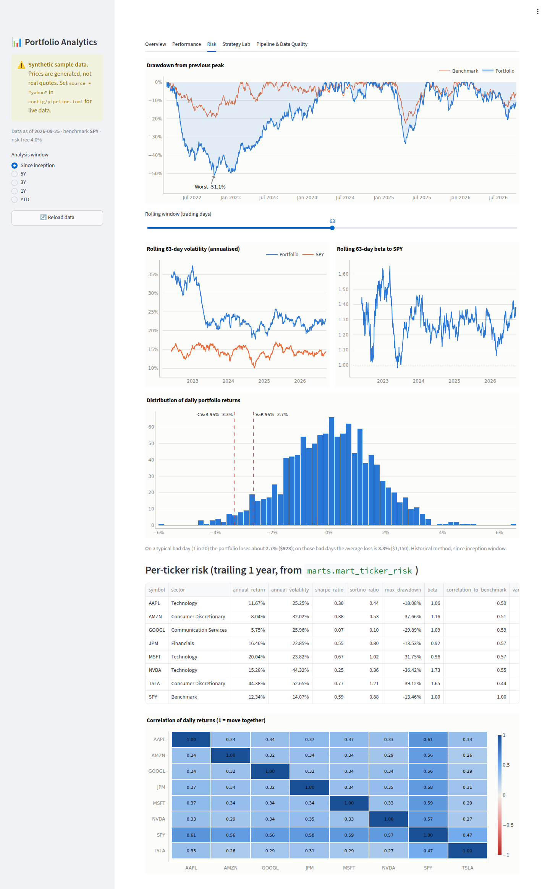
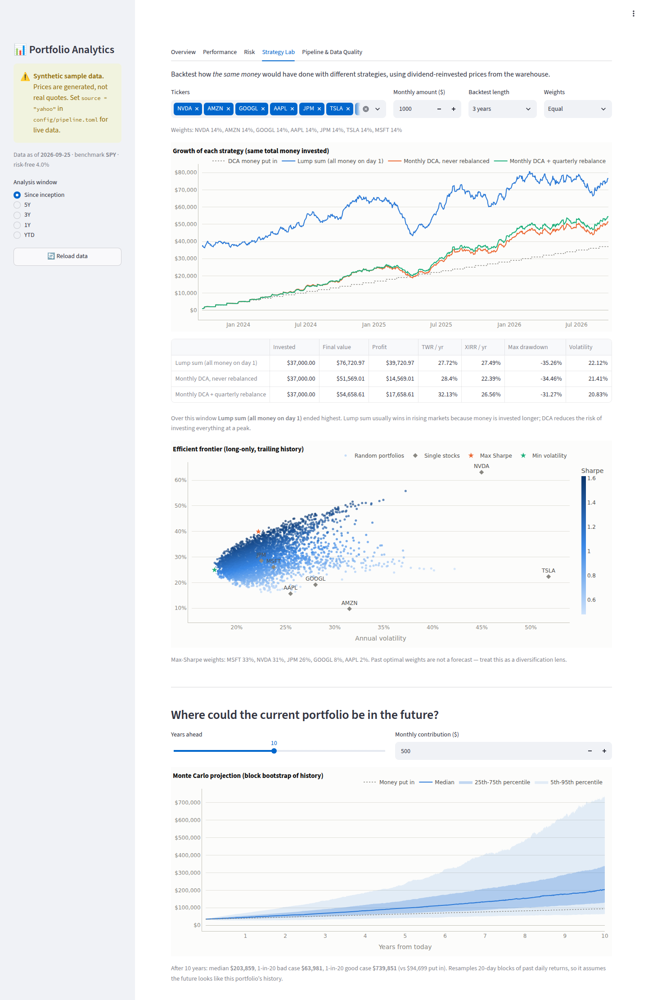
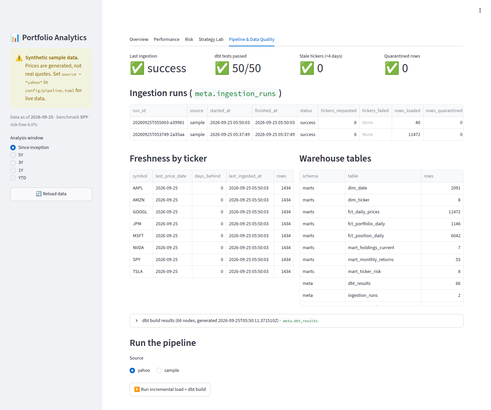

# 📊 Stock Portfolio Analytics — Data Engineering + Analytics Project

An end-to-end data project. Market data is ingested **incrementally**, landed as Parquet, modeled
into a **DuckDB star schema with dbt** (50 data tests), orchestrated by **Dagster** / GitHub
Actions, and served by a **Streamlit** dashboard. The dashboard covers benchmark-relative
performance, risk, strategy backtests and data-quality monitoring.

[](https://github.com/king2204/stock-analytics/actions/workflows/ci.yml)


```
yfinance ──► ingest.py ──► lake/raw/*.parquet (immutable, per run)
 (or the      │  incremental watermark + lookback, retries, quarantine
  offline     ▼
  sample) raw.* (DuckDB, upsert on natural key) ──► dbt: staging ► intermediate ► marts (+50 tests)
                                                                                     │
                     Dagster schedule / GitHub Actions cron (weekdays after US close)│
                                                                                     ▼
                                  Streamlit dashboard · SQL business questions · Jupyter report
```

## Quick start

```bash
pip install -r requirements-dev.txt

# Offline demo: deterministic synthetic market, no API needed
SOURCE=sample python -m pipelines.run
streamlit run app.py

# Real data from Yahoo Finance (the default source in config/pipeline.toml)
python -m pipelines.run
```

Or with Docker: `docker compose up` (dashboard on :8501). Add `--profile orchestration` to also
run Dagster on :3000.

| Command | What it does |
|---|---|
| `make pipeline` | Incremental load + `dbt build` (models + tests) + freshness check |
| `make test` | 45 pytest tests: unit tests plus full pipeline/dbt/dashboard/Dagster integration tests |
| `make dagster` | Dagster UI with assets, lineage, retries and the daily schedule |
| `make dbt-docs` | dbt docs site with model lineage graph |
| `make analysis` | Runs the 10 SQL business questions in `analysis/business_questions.sql` |
| `make notebook` | Re-executes the analysis report notebook |

---

## Data engineering

### Ingestion — `pipelines/ingest.py`
- **Incremental:** each ticker's high-water mark is `max(date)` in `raw.prices`. Only
  `watermark − 5 days … today` is requested. The overlap lets late provider corrections overwrite stale rows.
- **Idempotent:** `INSERT OR REPLACE` on the natural key `(symbol, date)`. Re-running a day never duplicates data (tested).
- **Immutable landing zone:** every batch is also written to
  `data/lake/raw/prices/symbol=X/ingest_date=D/<run_id>.parquet`, so the warehouse can be rebuilt without the API.
- **Resilience:** per-ticker retries with exponential backoff. One failing ticker marks the run
  `partial` instead of killing it.
- **Quarantine:** rows with a close ≤ 0, high < low, a close outside the high/low range, or a duplicate
  date go to `raw.prices_quarantine` with a reason. They are never silently dropped.
- **Run metadata:** every run is recorded in `meta.ingestion_runs` (status, rows, failures) and shown on the dashboard.
- **Pluggable sources:** `YahooSource` for real data, `SampleSource` for a deterministic synthetic market.
  The sample has real split and dividend events, so tests and CI never depend on the network.

### Modeling — `dbt/` (DuckDB)

| Layer | Models |
|---|---|
| staging (views) | `stg_prices`, `stg_dividends`, `stg_splits`, `stg_tickers`, `stg_transactions` |
| intermediate | `int_daily_returns` (total return from close + dividends), `int_transactions_split_adjusted`, `int_trade_ledger` (average-cost method via **recursive CTE**) |
| marts (tables) | `dim_date`, `dim_ticker`, `fct_daily_prices`, `fct_position_daily`, `fct_portfolio_daily` (TWR, drawdown, benchmark), `mart_holdings_current`, `mart_monthly_returns`, `mart_ticker_risk` |

Real-world issues the models handle:
- **Stock splits:** trades are entered as the broker showed them on the day, then restated by every
  later split. 1 AMZN share at $3,022 in 2022 becomes 20 shares at $151.10.
- **Restated `adj_close`:** providers rewrite adjusted prices backwards whenever a dividend is paid,
  which an incremental loader only partly picks up. Total return is therefore recomputed in SQL from
  `close + dividend`.
- **Cash flows:** portfolio return is time-weighted (it removes the effect of deposits and withdrawals).
  Money-weighted XIRR is shown alongside it.

### Data quality — 50 dbt tests + source freshness
Custom generic tests (`unique_combination_of_columns`, `positive`, `within_range`, `not_in_future`),
relationships, accepted values, and singular business-rule tests:

| Test | Catches |
|---|---|
| `assert_transaction_price_near_market` | A trade price >30% away from that day's close. This catches typos and pre/post-split mix-ups: **the original sample file had GOOGL at $2,800 in June 2023, when the stock traded near $124** |
| `assert_no_unexplained_price_jumps` | A >50% daily move with no split recorded (an unadjusted feed) |
| `assert_portfolio_reconciles_with_positions` | The portfolio mart drifting from the sum of its holdings |
| `int_trade_ledger.shares_after >= 0` | Selling more shares than you hold |
| source freshness | Prices older than 4 days (warn) / 7 days (error) |

### Orchestration
- **Dagster** (`pipelines/dagster_defs.py`): `raw_market_data` → `dbt_warehouse` assets, a freshness
  asset check, a retry policy with exponential backoff, and a weekday 17:30 New York schedule.
- **GitHub Actions:** `ci.yml` runs lint, `dbt parse` and the full test suite on every PR.
  `daily-pipeline.yml` is a zero-infrastructure daily cron that pulls Yahoo data incrementally
  (warehouse kept in the Actions cache) and publishes the DuckDB file plus test results as an artifact.

## Data analytics

The **dashboard** (`app.py`) reads only from the warehouse marts:

| Tab | Contents |
|---|---|
| Overview | Value vs money put in, TWR vs benchmark, XIRR, allocation by ticker/sector, concentration warning, P&L, split-restated trade ledger |
| Performance | Cumulative return vs SPY; Sharpe, Sortino, Calmar; beta, alpha, tracking error, information ratio, up/down capture; monthly return and excess-return heatmaps |
| Risk | Drawdown vs benchmark, rolling volatility and beta, VaR/CVaR histogram in dollars, per-ticker risk table, correlation matrix |
| Strategy Lab | Lump sum vs DCA vs DCA with quarterly rebalancing (same money), efficient frontier with max-Sharpe/min-vol picks, Monte Carlo block-bootstrap projection |
| Pipeline & Data Quality | Last runs, dbt test pass rate, freshness per ticker, table row counts, quarantined rows, a "run pipeline" button |

Also included:
- **`analysis/business_questions.sql`:** 10 SQL questions, e.g. did we beat the market, profit
  attribution, sector HHI, monthly hit rate, drawdown episodes and recovery time, dividend income,
  trade timing vs buying the benchmark, data coverage.
- **`notebooks/portfolio_analysis.ipynb`:** a report structured as question → method → findings
  (computed from the data) → recommendations and caveats.
- **`src/metrics.py` / `src/strategies.py`:** tested, dependency-light implementations of every metric and backtest.

## Screenshots

These were taken in **sample mode**, so the prices are synthetic.

| | |
|---|---|
|  |  |
|  |  |
|  | |

## Using your own portfolio
1. Add tickers (with sector) to `config/pipeline.toml`. Keep the benchmark in the list.
2. Put your trades in `data/portfolio_transactions.csv`, exactly as your broker shows them. Splits are handled for you.
3. Run `python -m pipelines.run`. If a trade price looks wrong, the dbt build fails and tells you which trade.

## Project layout
```
config/pipeline.toml        tickers, benchmark, source, paths
pipelines/                  sources, incremental ingestion, runner CLI, Dagster definitions
dbt/                        staging / intermediate / marts models, generic + singular tests
src/                        metrics, strategies, charts, warehouse query layer
app.py                      Streamlit dashboard (serving layer)
analysis/                   SQL business questions + runner
notebooks/                  analysis report
tests/                      pytest (unit + integration)
.github/workflows/          CI and the daily scheduled pipeline
```

The pre-warehouse dashboards (`streamlit_advanced.py`, `dashboard*.py`, `advanced_dashboard.py`,
`streamlit_app.py`) and their `src/analyzer.py`-era modules are still in the repo for reference only.
They are not part of the maintained code and are excluded from linting.

## Limitations
- The cost basis uses the average-cost method, not tax lots (FIFO).
- At portfolio level, dividends are counted as cash, not reinvested.
- Yahoo Finance is unofficial and rate-limited. For production use, swap in a paid API by adding a `PriceSource`.
- Backtests, frontier and Monte Carlo use history only and are not forecasts.

